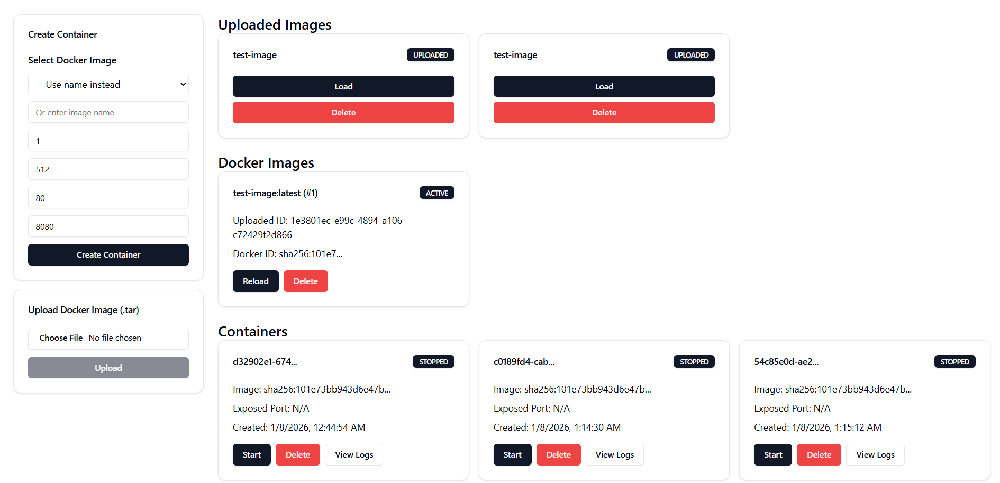

# Docker Image & Container Manager API

Small showcase project built with **FastAPI** to manage Docker images and containers, plus a **React** UI. The backend uses **SQLite with SQLAlchemy** for persistence. The goal is to demonstrate **clean FastAPI design**, **hexagonal architecture**, and **CI/CD with GitHub Actions**, while providing a solid and extensible foundation that could be evolved further.

---

## Features

* Upload Docker images as `.tar` files
* Track uploaded images and Docker-loaded images separately
* Create, start, stop, inspect and delete containers
* Fetch container logs
* Simple React UI to interact with the API
* Automatic testing & build pipelines (GitHub Actions)

---

## Architecture

```
                  ┌──────────────┐
                  │   React UI   │
                  └─────┬────────┘
                        │ HTTP requests
                        ▼
                  ┌──────────────┐
                  │   FastAPI    │
                  │   (API)      │
                  └─────┬────────┘
                        │ Calls
        ┌───────────────┴───────────────┐
        │                               │
┌───────────────┐                 ┌───────────────┐
│ ContainerSvc  │                 │  ImageSvc     │
└─────┬─────────┘                 └─────┬─────────┘
      │ Calls Repos / Docker                │ Calls Repos / Docker
      ▼                                     ▼
┌───────────────┐                 ┌─────────────────────┐
│ ContainerRepo │                 │ DockerImageRepo     │
│ UploadedImage │                 │ UploadedImageRepo   │
│ DockerRuntime │                 │ DockerRuntime       │
└─────┬─────────┘                 └─────┬───────────────┘
      │                                │
      ▼                                ▼
┌───────────────┐                 ┌───────────────┐
│ SQLite /      │                 │ SQLite /      │
│ Storage       │                 │ Storage       │
└───────────────┘                 └───────────────┘
```

> Both `ContainerService` and `ImageService` use SQLite via the repository adapters for persistence, while also interacting with DockerRuntime for container/image operations.

---

## Running the project

### Backend (FastAPI)

> **Prerequisite:** A Docker engine must be running on your machine for the API to manage containers and images.

```bash
cd API
python -m venv .venv
source .venv/bin/activate  # Windows: .venv\\Scripts\\activate
pip install -r requirements.txt

uvicorn app.main:app --reload
```

* API runs on: **[http://localhost:8000](http://localhost:8000)**
* Swagger UI: **[http://localhost:8000/docs](http://localhost:8000/docs)**

---

### Frontend (React)

```bash
cd ui
npm install
npm run dev
```

* UI runs by default on: **[http://localhost:5173](http://localhost:5173)**



---

## API Endpoints

### Containers

* `GET /containers` – List containers
* `POST /containers` – Create container
* `GET /containers/{container_id}` – Get container info
* `DELETE /containers/{container_id}` – Delete container
* `POST /containers/{container_id}/start` – Start container
* `POST /containers/{container_id}/stop` – Stop container
* `GET /containers/{container_id}/logs` – Get logs

### Images

* `POST /images/upload` – Upload Docker image (`.tar`)
* `GET /images/uploaded` – List uploaded images
* `GET /images/docker` – List Docker images
* `GET /images/uploaded/{image_id}` – Get uploaded image
* `GET /images/docker/{image_id}` – Get Docker image
* `POST /images/uploaded/{uploaded_img_id}/load` – Load uploaded image into Docker
* `POST /images/docker/{docker_id}/load` – Load Docker image
* `DELETE /images/uploaded/{uploaded_image_id}` – Delete uploaded image
* `DELETE /images/docker/{docker_image_id}` – Delete Docker image

---

## Folder Structure

### Root

```
PersonalAWS/
├── API/        # FastAPI backend
├── ui/         # React frontend
├── .github/    # GitHub Actions workflows
```

### Backend (`API/`)

```
API/
├── app/
│   ├── api/            # FastAPI routes
│   ├── core/           # Config & shared utilities
│   ├── domain/         # Domain models & ports
│   ├── repositories/  # Persistence adapters
│   ├── services/      # Application logic
│   ├── schemas/       # Pydantic schemas
│   └── main.py        # App entrypoint
├── storage/            # Uploaded image storage
├── tests/              # Automated tests
├── app.db              # Local SQLite DB
└── requirements.txt
```

### Frontend (`ui/`)

```
ui/
├── src/        # React source code
├── public/
├── dist/       # Production build
├── vite.config.ts
└── package.json
```

---

## CI / CD

* Automated testing
* Build validation
* Triggered via **GitHub Actions** on push / PR

---

## Purpose

This project showcases:

* FastAPI backend design
* Hexagonal architecture in practice
* Docker interaction via an API
* CI/CD pipelines
* A simple full-stack setup (FastAPI + React)

The system is designed with scalability and maintainability in mind. While additional hardening would be required for production environments, the architecture and patterns used are aligned with real-world backend systems.

---

## License

MIT License

This project is open-source. Anyone is free to use, modify, distribute, or build upon it without restriction.
